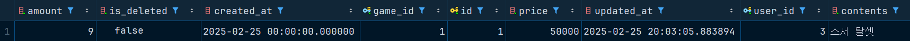
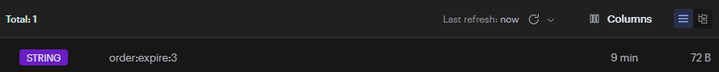

# Level_UP
 

## 🚀 프로젝트 소개
🛍️ **Level_UP** - 게임을 잘하고 싶은 사람들에게 멘토를 매칭해 주는 서비스입니다! 매칭된 사람들끼리의 실시간 채팅, 전체 커뮤니티등 다양한 기능을 함께 제공해 드립니다.

 

## 👤 팀원 소개

- **김효중**: Redis, 커뮤니티, 프로젝트 총괄
- **최대현**: 소켓,배포
- **이경훈**: ElasticSearch를 이용한 인기 검색어 조회 기능, 자동완성, 감성분석과 집계를 통한 Top3 선정, 클러스터를 이용한 분산 데이터 처리, 카테고리별 상품 개수 검색, ELK 기반 Log 관리
- **이동건**: Order, Bill, Payments 테이블 관리, 결제흐름 구현, 재고관리(Redis 분산락, 비관적락), 중복결제 생성 개선(Redis Listener TTL발생), 결제승인 재시도 기능
- **정영균**: 스프링 시큐리티

 

## 🎯 프로젝트 목표

### 1. JWT 및 스프링 시큐리티 / OAuth 2.0 소셜 로그인
- JWT 및 Spring Security 설정을 통해 인증 및 인가 로직 구현
- OAuth 2.0을 사용하여 소셜 로그인 기능 구현
  
#### 주요 기능  
- **일반 로그인**: email과 비밀번호를 통한 일반 로그인 기능
- **소셜 로그인**: 구글, 네이버 로그인을 통한 소셜 로그인 기능
- **자동 로그인**: 리프레시 토큰을 통한 자동 로그인 기능

#### 로그인 시스템 구성  
- **Spring Security**: 스프링 시큐리티를 통한 로그인 시스템 기본 구성  
- **JWT**: 액세스 토큰과 리프레시 토큰 발급을 위한 JWT
- **OAUTH2**: 소셜 로그인을 위한 OAUTH2 인증 시스템 
- **MySQL**: 회원 정보 저장을 위한 RDB.

 

### 2. ElasticSearch를 활용한 검색 서비스  

ElasticSearch는 대용량 데이터를 실시간으로 검색하고 분석할 수 있는 분산형 검색 엔진입니다.  
본 서비스에서는 ElasticSearch를 활용하여 **빠르고 정확한 검색 기능**을 제공합니다.

#### 주요 기능  
- **키워드 검색**: 상품명, 게임 장르, 설명(Contents) 등을 기반으로 검색 가능  
- **자동 완성(Auto-Suggest)**: 입력 중인 검색어에 대한 추천어 제공  
- **필터링 및 정렬**: 가격, 인기순, 최신 등록일 등의 필터 및 정렬 기능  
- **리뷰 감성 분석**: 검색 결과에 포함된 리뷰의 감성 점수를 분석하여 긍정적/부정적 리뷰 제공  

#### 검색 성능 최적화  
- **n-gram 토크나이저 적용**: 한국어 및 영어 검색을 위한 형태소 분석기 적용  
- **검색 인덱스 튜닝**: 불필요한 필드 제외 및 검색 성능 향상을 위한 캐싱 적용  
- **ElasticSearch Query DSL 활용**: 다중 필드 검색 및 적용  

 

### 3. 모니터링 서비스  

서비스의 원활한 운영을 위해 **실시간 모니터링 시스템**을 구축하여 장애 예방 및 성능 개선을 지원합니다.

#### 주요 모니터링 항목  
- **로그 모니터링(Log Monitoring)**: Logstash & Filebeat를 활용하여 서버 및 애플리케이션 로그 수집  
- **모니터링 시각화**: Kibana를 활용한 시스템 로그, 데이터 관리 시각화  
- **ElasticSearch 검색 성능 모니터링**: 검색 응답 시간 및 인덱스 크기 모니터링  

#### 모니터링 시스템 구성  
- **Elastic Stack(ELK)**: Elasticsearch + Logstash + Kibana를 이용한 로그 분석  
- **Fleet Server**: 서버 및 애플리케이션 성능 시각화  

 

### 4.알림 서비스

- 회원가입 완료시 회원가입 환영메시지가 가입 이메일을 통해 발송.
- 회원정보 변경감지시 로그인된 사용자에게 알림이 가도록 구현.

#### 알림 서비스 시스템 구성

- **Server Sent Event(SSE)**: 클라이언트와 서버의 연결 유지를 위한 표준 기술. 단방향 통신
- **Spring Event**: 알림을 변경 작업과 별개의 스레드로 동작시켜 변경 작업의 속도에 영향을 미치지 않게 하기 위한 스프링 이벤트
- **Redis**: SSE 연결 끊김 발생시 수신 성공한 메시지부터 다시 받아오기 위한 임시 보관용 Redis 캐시
- **MySQL**: 변경메시지와 타겟 유저, 변경시각, 알림 전송 성공 여부를 기록하기 위한 추가 RDB. 관리자만 접근가능.
  
 

### 5. 
- 

### 6. 빠르고 안전한 결제 경험 제공
- 카드, 간편결제, 계좌이체 토스페이 지원
- 토스 개발자 문서를 활용하여 빠르게API 연동 가능
- 실 결제 없이 테스트 가능
- 결제 관련 이메일 알림 전송
- 결제 취소 및 환불기능 지원
- 결제 승인 실패 시 재시도 전략 적용
- 안정적인 주문 처리 (트랜잭션 롤백, 재고 검증 및 관리)
- 재고 관리에 대한 악성유저 방지(Redis TTL발생 10분이내 결제되지않으면 HardDelete)

### 7. 
- 

### 8. 
- 
 
 

## 🏆 **Architecture** 

## 📝 **와이어프레임**

## 💬 **ERD**

 

|  Level_UP Team Notion |  발표 보고서 |  발표 영상 |
|:------:|:----------------------:|:----------------------:|
| [Notion 보러가기](https://www.notion.so/teamsparta/9-1962dc3ef51480d5b934d27f143c3c41) | [발표 보고서 보러가기](https://www.canva.com/design/DAGaRbld9so/37ehM1xDZDsknpC-fXeebQ/edit?utm_content=DAGaRbld9so&utm_campaign=designshare&utm_medium=link2&utm_source=sharebutton) | [발표 영상 보러가기](https://www.youtube.com/watch?v=-8S3XLLW6jA) |

 
 

## 📚 **기술 스택**

### Frontend

<table>
  <tr>
    <td width="80px" height="60px">
      
    </td>
    <td width="80px" height="60px">
      
    </td>
    <td width="80px" height="60px">
        
    </td>
    <td width="80px" height="60px">
        
    </td>
    <td width="80px" height="60px">
      
    </td>
  </tr>
  <tr align='center'>
    <td>HTML5</td>
    <td>CSS3</td>
    <td>React</td>
    <td>Typescript</td>
    <td>Tailwind  CSS</td>
  </tr>
</table>

<table>
  <tr>
    <td width="80px" height="60px">
      
    </td>
    <td width="80px" height="60px">
      
    </td>
    <td width="80px" height="60px">
       
    </td>
    <td width="80px" height="60px">
      
    </td>
    <td width="80px" height="60px">
      
    </td>
  </tr>
  <tr align='center'>
    <td>React Query</td>
    <td>Openvidu</td>
    <td>Stomp js</td>
    <td>Axios</td>
    <td>Zustand</td>
  </tr>
</table>

<table>
  <tr>
    <td width="80px" height="60px">
      
    </td>
    <td width="80px" height="60px">
      
    </td>
    <td width="80px" height="60px">
      
    </td>
  </tr>
  <tr align='center'>
    <td>Eslint</td>
    <td>Prettier</td>
    <td>Vite</td>
  </tr>
</table>

 

### Backend

<table>
  <tr>
    <td width="80px" height="60px">
       
    </td>
    <td width="80px" height="60px">
         
    </td>
    <td width="80px" height="60px">
        
    </td>
    <td width="80px" height="60px">
        
    </td>
    <td width="80px" height="60px">
      
    </td>
  </tr>
  <tr align='center'>
    <td>Java</td>
    <td>Spring</td>
    <td>Hibernate</td>
    <td>Mariadb</td>
    <td>MongoDB</td>
  </tr>
</table>

<table>
  <tr>
    <td width="80px" height="60px">
      
    </td>
    <td width="80px" height="60px">
      
    </td>
    <td width="80px" height="60px">
      
    </td>
    <td width="80px" height="60px">
      
    </td>
    <td width="80px" height="60px">
      
    </td>
  </tr>
  <tr align='center'>
    <td>Redis</td>
    <td>Swagger</td>
    <td>Jasypt</td>
    <td>Spring security</td>
    <td>Openvidu</td>
  </tr>
</table>

<table>
  <tr>
    <td width="80px" height="60px">
      
    </td>
  </tr>
  <tr align='center'>
    <td>Stomp js</td>
  </tr>
</table>

 

### DevOps

<table>
  <tr>
    <td width="80px" height="60px">
       
    </td>
    <td width="80px" height="60px">
       
    </td>
    <td width="80px" height="60px">
        
    </td>
    <td width="80px" height="60px">
        
    </td>
  </tr>
  <tr align='center'>
    <td>AWS</td>
    <td>Docker</td>
    <td>Nginx</td>
    <td>Jenkins</td>
  </tr>
</table>

 

### Tools

<table>
  <tr>
    <td width="80px" height="60px">
      
    </td>
    <td width="80px" height="60px">
      
    </td>
    <td width="80px" height="60px">
        
    </td>
    <td width="80px" height="60px">
      
    </td>
    <td width="80px" height="60px">
      
    </td>
  </tr>
  <tr align='center'>
    <td>Notion</td>
    <td>Gitlab</td>
    <td>Jira</td>
    <td>Gerrit</td>
    <td>Mattermost</td>
  </tr>
</table>

 

 

## 🔧 **성능 개선**

### 1. **레디스 캐싱**: 데이터 캐싱을 통한 빠른 응답 처리

**캐시 미적용**

**캐시 적용**

|        | **평균 응답속도** |
|--------|-------------|
| 캐시 미적용 | 5초 91ms     |
| 캐시 적용  | 1초 880ms    |

- **최적화 결과**
  - Redis Cache 적용 후 **평균 응답 속도 3초 211ms 향상** ㅇ

 
 
  
### 2. **Elasticsearch**: 엘라스틱 서치를 이용한 검색 속도 개선

| **검색 방법**                  | **설명**                         | **실행 속도 (ms)** |
  |--------------------------------|--------------------------------|-------------------|
| `getPopularKeywords()`         | 기본적인 검색어 집계            | **39ms**          |
| `getPopularKeywordsOptimized()` | 실행 힌트 적용 (`Map` 방식)     | **33ms**          |
| `getPopularKeywordsFastest()`   | 실행 힌트 + 쿼리 캐싱 적용      | **17ms**          |

- **최적화 결과**
    - 기본 검색 대비 **최대 2.3배 속도 향상**
    - `executionHint(TermsAggregationExecutionHint.Map)` 적용 시 **15% 속도 개선**
    - `requestCache(true)` 적용 후 **50% 추가 속도 개선**
    - 캐싱된 검색어 데이터를 활용하면 **0.1초 이내** 응답 가능

 
 
  
### 3. **Redis TTL** : 주문 후 10 분 결제 누락 시 악성재고관리 방지

위 상황은 주문을 만들었지만 결제를 진행하지않고 PENDDING 상태로 유지중.

주문 생성이 되면 재고 감소가 이루어진상황.

### 1. **개요**
   주문이 생성되었으나 결제가 진행되지 않으면 PENDING 상태로 유지됨.
   이때 재고 감소는 이미 적용된 상태.
   결제 없이 일정 시간이 지나면 주문을 자동 삭제하여 악성 재고를 방지.
### 2. Redis TTL 적용 방식
   TTL 설정
   주문이 생성되면 Redis에 TTL(10분) 설정.
   TTL이 설정된 주문은 10분 내 상태 변경이 없으면 자동 삭제.
   Redis Listener 활용
   TTL이 만료되면 삭제 이벤트를 감지하여 로그 기록.
   주문 삭제 시 재고를 원상 복구하여 악성 재고 방지.

- Redis Listener 활용
- 재고 감소가 이루어질 부분 분산락 적용
- TTL을 발생 시킨 후 만료되어 삭제 될때 로깅

TTL 발생을 로직으로 적용시켜 발생하면 레디스에 TTL데이터가 생성이됩니다.
10분 이내로 상태 변경이 일어나면 TTL은 삭제 되고 변경이 되지않는다면 
생성 되었던 Order는 HardDelete가 이루어집니다.

 
 

### 4. 

 

 

### 5. 

 
 

## 🔒 **트러블슈팅**

### 1. **엘라스틱 서치의 사용 이유**
   - Mysql로 기존의 30만 이상의 데이터에서 특정 단어가 포함된 데이터를 조회시 속도가 조금 느리다는 판단을 함(4.932초)

   -  속도의 개선을 위해서 캐시를 적용하거나 페이징을 통해 카테고리화를 수행하여 속도를 올려봄
   -  **속도를 개선하다보니 많은 현업의 몇 천만 데이터를 관리하기 위해서는 새로운 해답이 필요하다 생각하게 됨**
   -  레디스를 찾다가 엘라스틱 서치라는 것을 알게되어 적용 시작
   -  **Mysql과 다른 역인덱스 구조가 검색의 속도를 비약적으로 빠르게 해준다는 것을 학습**, 적용함
   -  Mysql에서 일부를 처시할 경우 5초가 걸렸지만 엘라스틱 서치의 힌트와 캐시를 적용한 후엔 0.2초가 걸리게 바뀜
   -  최종적으로 엘라스틱 서치를 적용하여 검색 속도를 향상
   -  (다만, mysql도 인덱싱을 잘한 상태라면 적은 데이터 셋에서는 엘라스틱 서치보다 빠를 수 있어, 적재적소에 사용해야한다는 것을 유념)
     

 

### 2. CustomOAuth2UserService에서 발생한 Exception이 상위로 던져지지 않는 문제

- CustomOAuth2UserService에서 발생한 로그인 실패 관련 커스텀 Exception들이 상위로 넘어가지 못해서 postman과 웹페이지로 표시가 되지 않는 문제가 발생하였다.
 
- 어떤 이유로 로그인에 실패했는지 명확하게 사용자에게 알려주기 위해서는 반드시 이 커스텀 Exception이 상위로 던져져야만 한다.
- 이 문제를 해결하기 위해 **어디에서 넘어가지 못했는지 알아보다가 **OAuth2LoginAuthenticationFilter**에서는 OAuth2AuthenticationException만 상위로 넘겨줄 수 있다는 것을 알게 되었다.**
- OAuth2AuthenticationException에 메시지부분에 발생한 Exception의 메시지를 넣어주고, Exception을 받는 핸들러부분에서 메시지를 꺼내 리턴해주면 해결될것이라 판단하였다.
- 해당 방식으로 구조를 변경한 후 정상적으로 익셉션이 상위로 리턴됨을 확인하였다.
 

 

### 3.

 

### 4. 

 

## 📈 **추가 개선 가능 점**

### 1.  **엘라스틱 서치 개발의 개선**
- 샤드 수가 너무 많으면 오버헤드가 증가하고, 너무 적으면 데이터 검색 속도가 저하된다. 이를 유념하여 조정이 필요하다.
- 데이터의 사용 빈도에 따라 핫(Hot), 웜(Warm), 콜드(Cold) 노드를 구성하여 리소스를 효율적으로 사용해야한다.
- 여러 클러스터로 나누어 데이터를 검색하거나 복자하여 대규모 환경에서도 안정적인 성능을 유지할 수 있도록 개발해야한다.
- 백업을 위한 스냅샷을 정기적으로 생성하도록 설정해야한다.

 

### 2. 알림 이메일 발송기능
- 기존에는 알림을 로그인된 사용자에게만 발생했으나, 해킹을 당해 적법한 사용자의 허가 없이 개인정보 변경작업이 일어나는 경우에 로그인이 되어있지 않은 사용자는 이 상황을 인지할 수 없는 문제가 있다는 것이 확인되어 개인정보 변경시에 사용자에게 알림을 보내주어, 사용자가 해킹을 당한 상태라는 것을 인지할 수 있게 만들어야 한다.
 

### 3. 

 

### 4. 

 

## 🤝 **팀원**

| 이름   | 깃허브                                                   |
|--------|---------------------------------------------------------|
| 김효중 | (https://github.com/rlagywnd4) |
| 최대현 | [https://github.com/DeaHyun0911](https://github.com/DeaHyun0911) |
| 이경훈 | [https://github.com/kyung412820](https://github.com/kyung412820) |
| 이동건 | (https://github.com/LeeDong-gun) |
| 정영균 | (https://github.com/lq0920084) |
---

