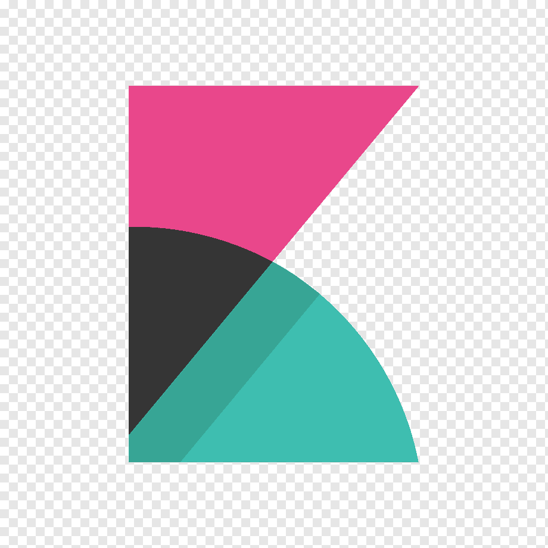

 

## 🎮 Level_UP - 원하는 멘토를 선택하고 실력을 키우는 게임 코칭 플랫폼! 🚀

 

## 👤 팀원 소개

  |                                         김효중                                          |                                        최대현                                        |                                                                  이경훈                                                                  |                                                                                         이동건                                                                                          |                                       정영균                                        |
  |:------------------------------------------------------------------------------------:|:---------------------------------------------------------------------------------:|:-------------------------------------------------------------------------------------------------------------------------------------:|:------------------------------------------------------------------------------------------------------------------------------------------------------------------------------------:|:--------------------------------------------------------------------------------:|
  |  |  |                                                        |                                                                                                      |  |
  |                      [@rlagywnd4](https://github.com/rlagywnd4)                      |                  [@DeaHyun0911](https://github.com/DeaHyun0911)                   |                                            [@kyung412820](https://github.com/kyung412820)                                             |                                                                    [@LeeDong-gun](https://github.com/LeeDong-gun)                                                                    |                    [@lq0920084](https://github.com/lq0920084)                    |
  |                                  프로젝트 총괄   커뮤니티                                  |                                      소켓, 배포                                       | ElasticSearch를 이용한 인기 검색어 조회 기능  자동완성  감성분석과 집계를 통한 Top3 선정   클러스터를 이용한 분산 데이터 처리   카테고리별 상품 개수 검색, ELK 기반 Log 관리 |             Order, Bill, Payments 테이블 관리   결제흐름 구현   재고관리(Redis 분산락, 비관적락)   중복결제 생성 개선(Redis Listener TTL발생)   결제승인 재시도 기능          |                                     스프링 시큐리티                                     |

 

## 목차
1. [주요 기능](#1)
2. [기능 설명](#2)
3. [아키텍처]()
4. [ERD]()

 

## 🚀 프로젝트 소개
🛍️ **Level_UP** - 게임을 잘하고 싶은 사람들에게 **멘토**를 **매칭**해 주는 서비스입니다! 

매칭된 사람들끼리의 실시간 채팅, 전체 커뮤니티등 다양한 기능을 함께 제공해 드립니다.

개발 기간: 2025.02.10 ~ 2025.03.17

## 💡 주요 기능

|       기능       | 내용                                                                                                |
|:--------------:|:--------------------------------------------------------------------------------------------------|
|     소셜 로그인     | 구글, 네이버를 통한 소셜 로그인                                                                                |
|   상품 검색 서비스    | 이것 저것 여러 방식으로 상품 검색 가능                                                                            |
|     알림 서비스     | 회원 정보 변경시 알림이 가요                                                                                  |
|     결제 서비스     | 상품 결제 가능해요                                                                                        |
|    커뮤니티 서비스    | 사용자들 끼리 글을 작성하고 조회가 가능                                                                            |
|      모니터링      | 로그 모니터링 가능~                                                                                       |
|       채팅       | 사용자들끼리 채팅기능을 활용하고 소통 가능~                                                                          |

 

## 🏆 **Architecture** 

## 📝 **와이어프레임**

## 💬 **ERD**

 

|  Level_UP Team Notion |  발표 보고서 |  발표 영상 |
|:------:|:----------------------:|:----------------------:|
| [Notion 보러가기](https://www.notion.so/teamsparta/9-1962dc3ef51480d5b934d27f143c3c41) | [발표 보고서 보러가기](https://www.canva.com/design/DAGaRbld9so/37ehM1xDZDsknpC-fXeebQ/edit?utm_content=DAGaRbld9so&utm_campaign=designshare&utm_medium=link2&utm_source=sharebutton) | [발표 영상 보러가기](https://www.youtube.com/watch?v=-8S3XLLW6jA) |

 
 

## 📚 **기술 스택**

### Frontend

<table>
  <tr>
    <td width="80px" height="60px">
      
    </td>
    <td width="80px" height="60px">
      
    </td>

  </tr>
  <tr align='center'>
    <td>HTML5</td>
    <td>CSS3</td>
  </tr>
</table>

 

### Backend

<table>
  <tr>
    <td width="80px" height="60px">
       
    </td>
    <td width="80px" height="60px">
         
    </td>
    <td width="80px" height="60px">
        
    </td>
    <td width="80px" height="60px">
      
    </td>
    <td width="80px" height="60px">
      
    </td>
  </tr>
  <tr align='center'>
    <td>Java</td>
    <td>Spring</td>
    <td>Mysql</td>
    <td>MongoDB</td>
    <td>Hibernate</td>
  </tr>
</table>

<table>
  <tr>
    <td width="80px" height="60px">
      
    </td>
    <td width="80px" height="60px">
      
    </td>
    <td width="80px" height="60px">
      
    </td>
    <td width="80px" height="60px">
      
    </td>
   <td width="80px" height="60px">
      
    </td>
  </tr>
  <tr align='center'>
    <td>Redis</td>
    <td>Spring security</td>
    <td>Stomp</td>
    <td>Websocket</td>
    <td>Gradle</td>
  </tr>
</table>

<table>
  <tr>
    <td width="80px" height="60px">
      
    </td>
   <td width="80px" height="60px">
      
    </td>
    <td width="80px" height="60px">
      
    </td>
   <td width="80px" height="60px">
      
    </td>
  </tr>
  <tr align='center'>
    <td>Logback</td>
    <td>Slf4j</td>
    <td>OAuth 2.0</td>
    <td>Jasypt</td>
  </tr>
</table>

<table>
  <tr>
    <td width="80px" height="60px">
      
    </td>
   <td width="80px" height="60px">
      
    </td>
    <td width="80px" height="60px">
      
    </td>
  </tr>
  <tr align='center'>
    <td>elasticsearch</td>
    <td>kibana</td>
    <td>logstash 2.0</td>
  </tr>
</table>

 

### DevOps

<table>
  <tr>
    <td width="80px" height="60px">
       
    </td>
    <td width="80px" height="60px">
       
    </td>
    <td width="80px" height="60px">
        
    </td>
  </tr>
  <tr align='center'>
    <td>AWS</td>
    <td>Docker</td>
    <td>GithubActions</td>
  </tr>
</table>

 

### Tools

<table>
  <tr>
    <td width="80px" height="60px">
      
    </td>
    <td width="80px" height="60px">
      
    </td>
    <td width="80px" height="60px">
        
    </td>
  </tr>
  <tr align='center'>
    <td>Notion</td>
    <td>Github</td>
    <td>Slack</td>
  </tr>
</table>

 

 

## 🔧 **성능 개선**

### 1. **레디스 캐싱**: 데이터 캐싱을 통한 빠른 응답 처리

**캐시 미적용**

**캐시 적용**

|        | **평균 응답속도** |
|--------|-------------|
| 캐시 미적용 | 5초 91ms     |
| 캐시 적용  | 1초 880ms    |

- **최적화 결과**
  - Redis Cache 적용 후 **평균 응답 속도 3초 211ms 향상** ㅇ

 
 
  
### 2. **Elasticsearch**: 엘라스틱 서치를 이용한 검색 속도 개선

| **검색 방법**                  | **설명**                         | **실행 속도 (ms)** |
  |--------------------------------|--------------------------------|-------------------|
| `getPopularKeywords()`         | 기본적인 검색어 집계            | **39ms**          |
| `getPopularKeywordsOptimized()` | 실행 힌트 적용 (`Map` 방식)     | **33ms**          |
| `getPopularKeywordsFastest()`   | 실행 힌트 + 쿼리 캐싱 적용      | **17ms**          |

- **최적화 결과**
    - 기본 검색 대비 **최대 2.3배 속도 향상**
    - `executionHint(TermsAggregationExecutionHint.Map)` 적용 시 **15% 속도 개선**
    - `requestCache(true)` 적용 후 **50% 추가 속도 개선**
    - 캐싱된 검색어 데이터를 활용하면 **0.1초 이내** 응답 가능

 
 
  
### 3. **Redis TTL** : 주문 후 10 분 결제 누락 시 악성재고관리 방지

위 상황은 주문을 만들었지만 결제를 진행하지않고 PENDDING 상태로 유지중.

주문 생성이 되면 재고 감소가 이루어진상황.

### 1. **개요**
   주문이 생성되었으나 결제가 진행되지 않으면 PENDING 상태로 유지됨.
   이때 재고 감소는 이미 적용된 상태.
   결제 없이 일정 시간이 지나면 주문을 자동 삭제하여 악성 재고를 방지.
### 2. Redis TTL 적용 방식
   TTL 설정
   주문이 생성되면 Redis에 TTL(10분) 설정.
   TTL이 설정된 주문은 10분 내 상태 변경이 없으면 자동 삭제.
   Redis Listener 활용
   TTL이 만료되면 삭제 이벤트를 감지하여 로그 기록.
   주문 삭제 시 재고를 원상 복구하여 악성 재고 방지.

- Redis Listener 활용
- 재고 감소가 이루어질 부분 분산락 적용
- TTL을 발생 시킨 후 만료되어 삭제 될때 로깅

TTL 발생을 로직으로 적용시켜 발생하면 레디스에 TTL데이터가 생성이됩니다.
10분 이내로 상태 변경이 일어나면 TTL은 삭제 되고 변경이 되지않는다면 
생성 되었던 Order는 HardDelete가 이루어집니다.

 
 

### 4. 

 

 

### 5. 

 
 

## 🔒 **트러블슈팅**

### 1. **엘라스틱 서치의 사용 이유**
   - Mysql로 기존의 30만 이상의 데이터에서 특정 단어가 포함된 데이터를 조회시 속도가 조금 느리다는 판단을 함(4.932초)

   -  속도의 개선을 위해서 캐시를 적용하거나 페이징을 통해 카테고리화를 수행하여 속도를 올려봄
   -  **속도를 개선하다보니 많은 현업의 몇 천만 데이터를 관리하기 위해서는 새로운 해답이 필요하다 생각하게 됨**
   -  레디스를 찾다가 엘라스틱 서치라는 것을 알게되어 적용 시작
   -  **Mysql과 다른 역인덱스 구조가 검색의 속도를 비약적으로 빠르게 해준다는 것을 학습**, 적용함
   -  Mysql에서 일부를 처시할 경우 5초가 걸렸지만 엘라스틱 서치의 힌트와 캐시를 적용한 후엔 0.2초가 걸리게 바뀜
   -  최종적으로 엘라스틱 서치를 적용하여 검색 속도를 향상
   -  (다만, mysql도 인덱싱을 잘한 상태라면 적은 데이터 셋에서는 엘라스틱 서치보다 빠를 수 있어, 적재적소에 사용해야한다는 것을 유념)
     

 

### 2. CustomOAuth2UserService에서 발생한 Exception이 상위로 던져지지 않는 문제

- CustomOAuth2UserService에서 발생한 로그인 실패 관련 커스텀 Exception들이 상위로 넘어가지 못해서 postman과 웹페이지로 표시가 되지 않는 문제가 발생하였다.
 
- 어떤 이유로 로그인에 실패했는지 명확하게 사용자에게 알려주기 위해서는 반드시 이 커스텀 Exception이 상위로 던져져야만 한다.
- 이 문제를 해결하기 위해 **어디에서 넘어가지 못했는지 알아보다가 **OAuth2LoginAuthenticationFilter**에서는 OAuth2AuthenticationException만 상위로 넘겨줄 수 있다는 것을 알게 되었다.**
- OAuth2AuthenticationException에 메시지부분에 발생한 Exception의 메시지를 넣어주고, Exception을 받는 핸들러부분에서 메시지를 꺼내 리턴해주면 해결될것이라 판단하였다.
- 해당 방식으로 구조를 변경한 후 정상적으로 익셉션이 상위로 리턴됨을 확인하였다.
 

 

### 3.

 

### 4. 

 

## 📈 **추가 개선 가능 점**

### 1.  **엘라스틱 서치 개발의 개선**
- 샤드 수가 너무 많으면 오버헤드가 증가하고, 너무 적으면 데이터 검색 속도가 저하된다. 이를 유념하여 조정이 필요하다.
- 데이터의 사용 빈도에 따라 핫(Hot), 웜(Warm), 콜드(Cold) 노드를 구성하여 리소스를 효율적으로 사용해야한다.
- 여러 클러스터로 나누어 데이터를 검색하거나 복자하여 대규모 환경에서도 안정적인 성능을 유지할 수 있도록 개발해야한다.
- 백업을 위한 스냅샷을 정기적으로 생성하도록 설정해야한다.

 

### 2. 알림 이메일 발송기능
- 기존에는 알림을 로그인된 사용자에게만 발생했으나, 해킹을 당해 적법한 사용자의 허가 없이 개인정보 변경작업이 일어나는 경우에 로그인이 되어있지 않은 사용자는 이 상황을 인지할 수 없는 문제가 있다는 것이 확인되어 개인정보 변경시에 사용자에게 알림을 보내주어, 사용자가 해킹을 당한 상태라는 것을 인지할 수 있게 만들어야 한다.
 

### 3. 

 

### 4. 

 

## 🤝 **팀원**

| 이름   | 깃허브                                                   |
|--------|---------------------------------------------------------|
| 김효중 | (https://github.com/rlagywnd4) |
| 최대현 | [https://github.com/DeaHyun0911](https://github.com/DeaHyun0911) |
| 이경훈 | [https://github.com/kyung412820](https://github.com/kyung412820) |
| 이동건 | (https://github.com/LeeDong-gun) |
| 정영균 | (https://github.com/lq0920084) |
---

